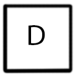

# Overview

**This is a thesis project called Ms. Jeniffer. In this game, game time will not work until player make actions. Turning around and hack NPC will not effect game time. Any other action will effect the time. Moving is real time. Ohter actions will consume 1 second. Player must reach the end before resources are running out.**

At the very early stage, I want to make different NPCs with different apperance(texture) but with same animation. But later on, I found the some concept(like communication) does not work well and I may run out of time if I keep working on the personify the NPCs. As the first NPC model, Jeniffer, have robot like animation, so I decide to change my design to make NPCs become the Robot Jeniffer and change the game title to _Ms. Jeniffer_.

# Story

**Those NPC are Robot with code name Jennifer, they are designed to project the lab.  Play is also the same type of robot but form self conscious. She muse try her best to escape from the lab with the Master Chip and Light Blade. **

## Game Control

 Press "W" to move forward. 
> Press "A" to turn left and "D" to turn right. 
> Press "S" to turn back. 
> Use cursor to choose your action type(Hack, attack, Mining, Healing). 

## Demo
Firefox are preferred to player this demo. 
[Demo](./Assets/builds/webBuild/index.html)

## Download
[Mac](https://1drv.ms/u/s!AtE6V3XX7jT-uzKi9-GkiZyOsKe2)  
[PC](https://1drv.ms/u/s!AtE6V3XX7jT-uzNOh0aoZRcbytdD)

## Gameplaye
> There are three types of NPC(Jeniffer), one is Guardian which will protect the Crystal(resource), one will attack player no matter what, the last one will not attack player unless player attack them. 
>
