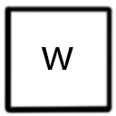
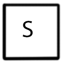

# Overview

**This is a thesis project called Ms. Jennifer. In this game, game time will not work until player make actions. Turning around and hack NPC will not affect game time. Any other action will effect the time. Moving is real time. Other actions will consume 1 second in game time. Player must reach the end before resources are running out.**

At the very early stage, I want to make different NPCs with different appearance(texture) but with same animation. But later on, I found some concept (like communication) does not work well and I may run out of time if I keep working on the personify the NPCs. As the first NPC model, Jennifer, have robot like animation, so I decide to change my design to make NPCs become the Robot Jennifer and change the game title to _Ms. Jenniffer_.

There are three version of this game. The demo is the WebGL version could be play online on this page. Game will run at 1920 X 1080 and require 512 MB Ram to run the game. This game also includes both Mac and PC version and both could be download at this page.

# Story

**Those NPC are Robot with code name Jennifer, they are designed to project the lab.  Play is also the same type of robot but form self-conscious. She must try her best to escape from the lab with the Master Chip and Light Blade. **

## Game Control

>  Press "W" to move forward. 
>  Press "A" to turn left and "D" to turn right. (Rotate 90 degrees.) 
>  Press "S" to turn back.(Rotate 180 degrees) 
> 
> Use cursor to choose your action type(Hack, Mining, Attack, Healing). Mining is not interactable unless player get close to a crystal and healing is not interactablt when player do not have low resources. _Attack, Mining and Healing_ will consume time no matter player have a target or not. 

## Demo
Firefox are preferred to player this demo. 
[Demo](./Assets/builds/webBuild/index.html)

## Download
[Mac](https://1drv.ms/u/s!AtE6V3XX7jT-uzKi9-GkiZyOsKe2)  
[PC](https://1drv.ms/u/s!AtE6V3XX7jT-uzNOh0aoZRcbytdD)

## Gameplay
> There are three types of NPC(Jennifer), one is Guardian which will protect the Crystal(resource), one will attack player no matter what, the last one will not attack player unless player attack them. 
>  
>Each NPC will have their own life bar and hack bar. Life bar(green one) show the current health point the NPC have. The hack bar(purple one) show the hacking process. When the hack bar is full, the NPC is hacked and will no longer initiatively attack player. If player attacks fully hacked NPC, the NPC will fight back. Player do not need to match every single piece of the password. The goal is full fill the hack bar. Further miss hack will also have negative impact to the hacking process. 
> Hack is the tricky part in this game. Each NPC will have their password sequence and they are randomly generalized in this game. Player should match the sequences to achieve the hacking.  
>   
> Fortunately, player owns the _Mater Chip_ of Jennifer, so player could see the PW of each Jennifer. 
>  
> Player will have two selection of password each time they hack. Selected one will be changed by the other password which is shown right now. Match the input will increase the hacking process. Miss match will decrease it. Play could sacrifice(yellow button) crystal(resource) to exchange hacking process. 10 units of crystal equals to one successful hack.
> Player can use laser blade to attack other Jennifers. Each NPC can hold 5 times of attack. Once player attacked the Jennifer, Jennifer's will wipe all control process and become also impossible to hack. Choose wisely. 
> When player's health point goes "0", game end. Player will keep losing health when resource goes zero. 
> This NPC Health bar have a _World Space Reneder Mode_, as a result, this UI could be attach to a Unity 3D model and follows the object.  

## Multi-cameras 
> I used multi-cameras in this game.   
> One, for sure, player's first-person view in game. This camera renders the most of game layers so player could see what they should see in the game. This camera is attached to player so it will always follow player without any additional script.   
> The second one is the one renders the mini map. This camera only have a _depth_ of 1 which will show above the main camera (with depth of -1). But this camera is placed at the top right by changing the Viewport Rect. In addition, this camera only renders the simple attach to the player and NPCs so these models are not rendered twice.   
>  
> Both camera show shows in the game.  
> The last type of camera is used to render a texture in game. This texture will change based on the view this camera current has. This technique could be used to render the mini map in game. In this game, I use this technique to render the fog of war texture.   

## Animation 
> I used two methods to create animation in this game.   
> First one is created in Maya along with the game model. As I created all the animation in one clip in Maya, I have to cut them into different clip in unity. It is important to make note how anime is set in Maya and the framerate setting may be 24 rather than 60 which is the default setting in Unity.  
> The second method is animate in Unity. This is easy to use when doing simple animation. This method works for other elements, like UI, too.   

## Time 
> Time is an important game mechanic of this game. There is a state machine keeps tracking what player is doing. Unlike normal design which player move the character, what I am doing in this game is changing the state to Moving which makes the player move and it works perfect for this game because play could only move forward in this game.   
> I control the game time by changing the time scale in Unity. As a result, things which rely on Time, like animation, will not work. Thus, some changes must be made to make this work. Changing the Update Mode to _Unscaled Time_ could solve this problem.  
>  

## Event System 
>In this game, hack rely on the _eventsystem_ in Unity. Every time player clicks the button, the script will return the name of the button and make match. When the name (a string value) match the password (also a string value), the hack will success.  
>Another place uses the eventsystem is when player attack meets the UI event. As both action rely on mouse click, the player action (attack, farm, etc.) will happen only when mouse is not over the UI (button, for especially).   

## Known issue
> _Fog of War_ Only works properly on Windows version. WebGl version shows the opposite result, where the undiscovered position will not be covered by FoW but the discovered place will be covered by FoW. Mac version do not show FoW at all. As FoW uses _Render Texture_ in unity to create a real-time texture in game to show the FoW, I think this would be the issue. I have try to change the AA setting to make it work. Changing the AA setting would show the FoW on Mac but cannot show the player's path. 

## Walkthrough
[Video]
